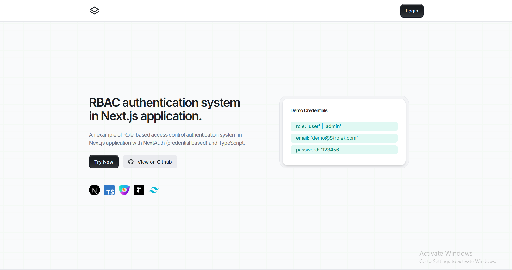

## **RBAC authentication system in Next.js application.**

### **An example of Role-based access control authentication system in Next.js application with NextAuth (credential based) and TypeScript.**

### **Features:**

- **SignIn with Credentials (Email, Password)**
- **Role-based access control**
- **Handling user request with middleware**
- **Extending user session (token, id)**
- **Validate user input in both client and server side**
- **Next.js Server actions with 'useTransition()' hook**
- **Accessing user session in both client and server components**

### **Build With:**

- **Next.js 15**
- **TypeScript**
- **Tailwind CSS**
- **Radix UI**
- **Next-Auth v5**

### **Live Link: [https://nextauthentication.vercel.app](https://nextauthentication.vercel.app)**
